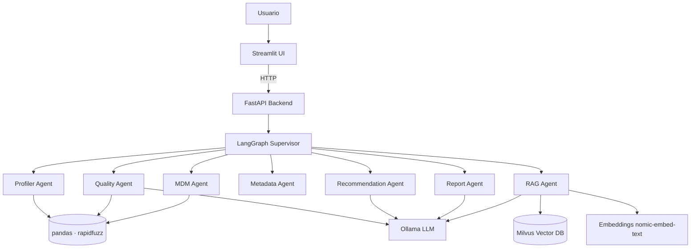

# DataGov Agent — Explicación Técnica Detallada

> Documento de referencia profesional: **qué es** el sistema, **cómo se construyó cada parte**,
> **qué hace**, **qué tecnología usa**, **dónde está la IA** y **por qué se diseñó así**.
> Pensado para defender el proyecto en una entrevista técnica.

---

## Índice
1. [¿Qué es DataGov Agent? (y la pregunta "¿es IA?")](#1-qué-es-datagov-agent)
2. [El principio de diseño: 3 capas](#2-el-principio-de-diseño-tres-capas)
3. [Arquitectura general](#3-arquitectura-general)
4. [Stack tecnológico y por qué cada pieza](#4-stack-tecnológico)
5. [Configuración y modelo de datos](#5-configuración-y-modelo-de-datos)
6. [Capa 1 — Herramientas deterministas (NO IA)](#6-capa-1--herramientas-deterministas)
7. [Capa 2 — IA generativa (LLM + RAG)](#7-capa-2--ia-generativa-llm--rag)
8. [Capa 3 — Orquestación agéntica (LangGraph)](#8-capa-3--orquestación-agéntica-langgraph)
9. [Capa de servicio: API y UI](#9-capa-de-servicio-api-y-ui)
10. [¿Dónde está exactamente la IA?](#10-dónde-está-exactamente-la-ia)
11. [Degradación: sin Ollama / sin Milvus](#11-degradación-qué-pasa-sin-ollama-o-sin-milvus)
12. [Por qué se diseñó así (decisiones de ingeniería)](#12-por-qué-se-diseñó-así)
13. [Cómo defenderlo en entrevista](#13-cómo-defenderlo-en-entrevista)
14. [Glosario](#14-glosario)

---

## 1. ¿Qué es DataGov Agent?

DataGov Agent es un **sistema agéntico local de gobierno, calidad, MDM y catalogación de datos**.
Carga datasets empresariales (clientes, productos, ventas, proveedores, sucursales) y documentos de
gobierno; **detecta problemas de calidad**, **clasifica datos sensibles**, **propone reglas**,
**encuentra duplicados (MDM)**, **responde preguntas sobre políticas internas (RAG)** y **genera un
reporte ejecutivo**. Corre 100% en local, sin servicios de pago.

### ¿Es "IA"? La respuesta honesta y profesional
**Sí, es un sistema de IA — pero no todo lo que hace es IA, y eso es deliberado.** "IA" es un
paraguas que mezcla cosas distintas. En este proyecto conviven tres tipos de tecnología:

| Tipo | ¿Es "IA generativa"? | Ejemplo en el proyecto |
| ---- | -------------------- | ---------------------- |
| Algoritmos deterministas (reglas, regex, matemática, similitud de texto) | No | Perfilado, calidad, score, MDM |
| IA generativa (un LLM que razona y redacta) | **Sí** | Narrativas, recomendaciones, respuestas RAG |
| Orquestación agéntica (decide qué herramienta usar) | Es el "pegamento" de la IA | LangGraph: supervisor + 7 agentes |

> **Frase clave:** *No se le pide a un modelo de lenguaje que cuente filas o valide formatos —
> para eso el código es exacto y el LLM alucinaría. El LLM se reserva para razonar y redactar.
> Esto se llama patrón de **agentes con herramientas (tool use)** y es cómo se construyen los
> sistemas de IA serios.*

**Analogía:** un analista de datos (la IA) usa Excel/SQL (herramientas deterministas) para sacar
números exactos y luego **escribe el informe** con sus palabras. No adivina cuántos errores hay:
corre la consulta. DataGov Agent hace lo mismo.

---

## 2. El principio de diseño: tres capas

```
┌─────────────────────────────────────────────────────────────┐
│  CAPA 3 — AGÉNTICA (el "director")                           │
│  LangGraph: el supervisor decide qué agente actúa y cuándo   │
└───────────────┬─────────────────────────────────────────────┘
                │ orquesta
   ┌────────────┴───────────────┬──────────────────────────────┐
   ▼                            ▼                              ▼
┌──────────────────────┐  ┌──────────────────────┐  ┌──────────────────────┐
│ CAPA 1 — HERRAMIENTAS │  │ CAPA 2 — IA GENERATIVA│  │ CAPA DE SERVICIO     │
│ DETERMINISTAS (no IA) │  │ (LLM + embeddings)    │  │ API + UI             │
│ pandas, regex,        │  │ Ollama, Milvus,       │  │ FastAPI, Streamlit   │
│ rapidfuzz, matemática │  │ LangChain RAG         │  │                      │
│ → perfila, valida,    │  │ → razona, redacta,    │  │ → expone y visualiza │
│   detecta, calcula    │  │   responde preguntas  │  │                      │
└──────────────────────┘  └──────────────────────┘  └──────────────────────┘
```

- **Capa 1 (exacta):** cálculos auditables y reproducibles. Funcionan **sin** ningún modelo.
- **Capa 2 (inteligente):** lenguaje, razonamiento, búsqueda semántica. Usa Ollama y Milvus.
- **Capa 3 (agéntica):** decide el flujo según la entrada (dataset / documento / pregunta).

---

## 3. Arquitectura general



**Flujo del grafo (LangGraph):**
```
START → load_input → classify_input
   ├── dataset:  profile → quality → mdm → catalog → recommendations → report → END
   ├── document: ingest_documents → END
   └── question: answer_with_rag → END
```

### Estructura del repositorio (resumen)
```
app/
├── config.py              # configuración (.env) y rutas
├── main.py                # FastAPI
├── api/                   # routes_data, routes_rag, routes_reports, store
├── agents/                # supervisor + 7 agentes + prompts
├── graph/                 # state, nodes, workflow (LangGraph)
├── services/              # entities, data_loader, profiler, quality_rules, mdm,
│                          # embeddings, vector_store, llm, report_generator
├── schemas/               # modelos Pydantic
└── utils/                 # logging, file_utils, text_cleaning
ui/streamlit_app.py        # interfaz (6 pantallas)
datagov_agent_dataset/     # DATASET CANÓNICO (datos + documentos + ground truth)
scripts/validate_dataset.py# valida detecciones vs ground truth
tests/                     # profiler, quality, mdm, rag
docs/                      # manuales y esta explicación
```

---

## 4. Stack tecnológico

| Componente | Herramienta | Por qué |
| ---------- | ----------- | ------- |
| Lenguaje | Python 3.11 | Ecosistema de datos/IA maduro |
| Análisis de datos | **pandas, numpy** | Cálculo exacto y vectorizado |
| Similitud de texto | **rapidfuzz** | Matching de duplicados (MDM) rápido |
| Validación de esquemas | **Pydantic v2** | Modelos tipados y serialización JSON |
| LLM local | **Ollama** (Llama 3.1 8B) | IA generativa sin nube ni costo |
| Embeddings | **nomic-embed-text** (Ollama) | Vectorizar texto para RAG |
| Base vectorial | **Milvus** (Docker) | Búsqueda semántica de documentos |
| RAG / loaders / splitters | **LangChain** | Chunking, prompts, integración LLM |
| Orquestación de agentes | **LangGraph** | Flujo condicional con estado |
| Backend | **FastAPI** | API tipada y `/docs` automático |
| Frontend | **Streamlit** | Demo visual rápida |
| Reportes | markdown, **xhtml2pdf** | MD/HTML/JSON/PDF |
| Tests / formato | **pytest, ruff, black** | Calidad de código |

---

## 5. Configuración y modelo de datos

### `app/config.py` — configuración tipada
Usa `pydantic-settings`: lee variables del `.env` con valores por defecto. La **fuente canónica de
datos** es el paquete `datagov_agent_dataset/`.

```python
class Settings(BaseSettings):
    ollama_base_url: str = "http://localhost:11434"
    llm_model: str = "llama3.1:8b"
    embed_model: str = "nomic-embed-text"
    milvus_uri: str = "http://localhost:19533"
    rag_top_k: int = 6
    documents_dir: str = "datagov_agent_dataset/data/documents"
    expected_outputs: str = "datagov_agent_dataset/data/expected_outputs/known_issues_expected.json"
```

### `app/services/entities.py` — el "mapa" del negocio
Centraliza qué columnas son **clave primaria (PK)**, **clave de negocio** y **clave foránea (FK)**.
Es la pieza que evita un error sutil: marcar como "duplicado" una FK que *legítimamente se repite*
(p. ej. `ventas.cliente_id` aparece muchas veces, y está bien).

```python
PRIMARY_KEYS = {"clientes": "cliente_id", "productos": "producto_id",
                "proveedores": "proveedor_id", "ventas": "venta_id", "sucursales": "sucursal_id"}
EXPLICIT_KEYS = {"dni", "ruc", "sku"}                # también deben ser únicas
FK_RELATIONS = {                                      # hija -> (tabla_padre, col_padre)
    "cliente_id":   ("clientes", "cliente_id"),
    "producto_id":  ("productos", "producto_id"),
    "proveedor_id": ("proveedores", "proveedor_id"),
    "sucursal_id":  ("sucursales", "sucursal_id"),
}

def unique_key_fields(table, columns) -> list[str]:
    """Columnas que DEBEN ser únicas: la PK de la tabla + claves de negocio (no las FK)."""
    ...
```

> **Por qué importa:** el perfilado y la calidad consultan esto para medir unicidad solo en PK y
> claves de negocio. Es un detalle de **modelado de datos** que diferencia un proyecto serio de uno
> de juguete.

---

## 6. Capa 1 — Herramientas deterministas

> **Esto NO es IA.** Es ingeniería de datos: reglas, regex, matemática y algoritmos clásicos.
> Es exacto, rápido, reproducible y **auditable**. Funciona sin Ollama ni Milvus.

### 6.1 `data_loader.py` — ingestión
Lee CSV/Excel (a `DataFrame`) y PDF/TXT/MD/DOCX (a texto), probando codificaciones (`utf-8`,
`latin-1`) y separadores. Devuelve los datos + `FileMetadata` (filas, columnas, tipo, fecha de carga).
Tecnología: **pandas, openpyxl, pypdf, python-docx**. No hay IA.

### 6.2 `profiler.py` — perfilado técnico (Módulo 2)
**Qué hace:** por cada columna calcula nulos, únicos, tipo, mín/máx/promedio, cardinalidad, y marca
**posibles identificadores** y **posibles datos personales (PII)** por heurística de nombre + regex.

```python
SENSITIVE_NAME_HINTS = {"dni": "documento de identidad", "correo": "correo electrónico",
                        "telefono": "número telefónico", "direccion": "dirección física", ...}
EMAIL_RE = re.compile(r"^[^@\s]+@[^@\s]+\.[^@\s]+$")

def _sensitive_reason(name, series):
    for hint, reason in SENSITIVE_NAME_HINTS.items():
        if hint in name.lower():
            return reason                       # PII por NOMBRE de columna
    sample = series.dropna().astype(str).head(50)
    if sample.map(lambda v: bool(EMAIL_RE.match(v.strip()))).mean() > 0.6:
        return "correo electrónico"             # PII por CONTENIDO (muchos emails)
    return None
```

**Cómo funciona "detectar datos personales" sin IA:** dos heurísticas — (1) el **nombre** de la
columna contiene `dni`/`correo`/`telefono`/…; (2) el **contenido** tiene forma de email (regex en
>60% de la muestra). Es determinista: el mismo dataset siempre da el mismo resultado.

### 6.3 `quality_rules.py` — calidad + score (Módulo 3)
**Qué hace:** evalúa **8 dimensiones de calidad** y produce una lista de hallazgos + un **score 0–100**.
Cada chequeo es una función independiente:

| Dimensión | Chequeo | Técnica |
| --------- | ------- | ------- |
| Completitud | nulos/vacíos por campo | `_empty_mask` (pandas) |
| Unicidad | duplicados en PK / claves de negocio | `unique_key_fields` + `duplicated()` |
| Validez | DNI (8 díg.), RUC (11 díg.), email, precio<0, cantidad=0, fecha futura | **regex + comparaciones** |
| Consistencia/Conformidad | país/categoría escritos de formas distintas | normalización de texto |
| Exactitud | `total == cantidad × precio_unitario` | aritmética |
| Integridad referencial | FK huérfanas (cliente/producto/proveedor/sucursal inexistente) | `isin()` contra tabla padre |
| Clasificación | campos PII sin catalogar | heurística |

Ejemplo — integridad referencial (el "cliente inexistente"):
```python
for fk, (parent_table, parent_col) in FK_RELATIONS.items():
    child = df[fk][~_empty_mask(df[fk])].astype(str).str.strip()
    valid_keys = set(parent_df[parent_col].dropna().astype(str).str.strip())
    orphans = int((~child.isin(valid_keys)).sum())     # ¿cuántas FK NO existen en el padre?
```

**El score** parte de 100 y resta penalizaciones por dimensión (con tope, para no saturar a 0):
```python
PENALTY = {"unicidad": 18, "integridad referencial": 18, "validez": 7, "completitud_critico": 10, ...}
DIMENSION_CAP = {"completitud": 16, "unicidad": 18, "validez": 14, ...}   # topes suman ~85
score = max(0, 100 - total_penalizado)
risk  = "bajo" if score >= 80 else "medio" if score >= 65 else "alto"
```
Es una **fórmula transparente**: cualquiera puede recalcularla a mano. Eso es clave para gobierno
de datos (las decisiones deben justificarse, no salir de una "caja negra").

### 6.4 `mdm.py` — duplicados y golden record (Módulo 4)
**Qué hace:** encuentra registros que son la misma entidad del mundo real con dos técnicas:
1. **Coincidencia exacta** por clave (DNI/RUC/SKU) → duplicado de alta confianza (0.98).
2. **Similitud de nombres** con **rapidfuzz** (`token_sort_ratio ≥ 88`) + coincidencia de correo.

```python
score = fuzz.token_sort_ratio(norm_names[i], norm_names[j])   # 0-100, NO es IA
email_match = normalize_email(a) == normalize_email(b) != ""
if score >= NAME_SIMILARITY_THRESHOLD or email_match:
    cluster.append(j)            # "Juan Pérez" ~ "Juán Perez" → mismo cliente
```

Luego construye el **golden record** (registro consolidado): por cada columna elige el valor no nulo
más **frecuente**; ante empate, el más **largo** (más completo).

> `rapidfuzz` mide *distancia de edición* entre cadenas (cuántos cambios para pasar de un texto a
> otro). Es un **algoritmo clásico**, no aprendizaje automático ni IA generativa.

---

## 7. Capa 2 — IA generativa (LLM + RAG)

> **Aquí sí hay IA.** Un modelo de lenguaje (Llama 3.1 8B vía Ollama) razona y redacta; los
> embeddings vectorizan texto para búsqueda semántica.

### 7.1 `embeddings.py` — vectorizar texto
Un **embedding** convierte texto en un vector numérico para comparar significado. Dos backends:
- **`OllamaEmbeddingBackend`** (real): usa `nomic-embed-text`. Captura semántica.
- **`HashingEmbeddings`** (fallback determinista): vector por conteo de palabras hasheadas. No es
  semántico, pero permite que los tests y la demo corran **sin Ollama**.

```python
def get_embeddings(prefer_ollama=True) -> EmbeddingBackend:
    if prefer_ollama and ollama_available():
        return OllamaEmbeddingBackend()      # semántico
    return HashingEmbeddings()               # determinista (sin modelo)
```

### 7.2 `vector_store.py` — base vectorial
Interfaz común con dos implementaciones:
- **`MilvusVectorStore`** (producción): guarda los vectores en Milvus (Docker). Soporta
  `similarity_search`, `keyword_search` (filtro `like`) y `fetch_adjacent` (fragmentos vecinos).
- **`InMemoryVectorStore`** (tests/degradado): coseno con numpy en memoria.

```python
def get_vector_store(embeddings=None, backend="milvus") -> BaseVectorStore:
    if backend == "memory":
        return InMemoryVectorStore(embeddings)
    if not milvus_available():
        raise RuntimeError("Milvus no está disponible … 'docker compose up -d'")   # error accionable
    return MilvusVectorStore(embeddings)
```

### 7.3 `llm.py` — el modelo de lenguaje con degradación elegante
Envuelve `ChatOllama`. **Si Ollama no responde, `complete()` devuelve `None`** y cada agente usa su
respaldo determinista. Esa es la clave de la robustez.

```python
class LLMClient:
    def __init__(self):
        self.available = ollama_available()        # ¿hay modelo?
    def complete(self, system, user, json_mode=False) -> str | None:
        if not self.available:
            return None                             # → el agente usa su fallback
        return self._chat.invoke([SystemMessage(system), HumanMessage(user)]).content
```

### 7.4 `rag_agent.py` — RAG (Módulo 6), la parte más sofisticada
**RAG = Retrieval-Augmented Generation:** en vez de que el modelo "se invente" la respuesta, primero
**recupera** los fragmentos relevantes de tus documentos y **responde solo con base en ellos** (y
cita las fuentes). Pasos:

1. **Chunking**: parte los documentos en fragmentos (`RecursiveCharacterTextSplitter`, ~800 chars).
2. **Recuperación vectorial**: busca los `k` fragmentos más parecidos a la pregunta (semántico).
3. **Búsqueda híbrida** (`_augment_with_keywords`): para referencias **exactas** ("artículo 16"),
   que el vector no discrimina bien, refuerza con búsqueda **léxica** (`like %artículo 16%`).
4. **Expansión de contexto** (`_expand_context`): trae los fragmentos **vecinos** de los mejores
   resultados para reconstruir secciones largas que el chunking partió.
5. **Generación**: el LLM responde con un prompt **estricto** (no inventar; citar fuente; confianza).
6. **Anti-alucinación**: si no hay sustento, responde literalmente
   *"No se encontró sustento suficiente en los documentos cargados."*

```python
chunks = store.similarity_search(question, k=k)                 # 2) semántico
chunks = _augment_with_keywords(store, question, chunks, k)     # 3) léxico exacto
chunks = _expand_context(store, chunks, window=3, top_n=2)      # 4) vecinos
if not chunks:
    return RagAnswer(answer=NO_SUPPORT, grounded=False)         # 6) no alucina
# 5) el LLM redacta SOLO con el contexto recuperado + cita 'sources'
```

> Esta combinación (vectorial + léxico + expansión de contexto) es una técnica avanzada de RAG.
> Demuestra que entiendes las **limitaciones** de la búsqueda puramente vectorial.

---

## 8. Capa 3 — Orquestación agéntica (LangGraph)

> **Esto es lo "agéntico".** No es un solo prompt: es un **grafo de estados** donde un supervisor
> decide la ruta y agentes especializados se ejecutan en orden.

### 8.1 `supervisor.py` — el router
Decide la ruta (dataset / documento / pregunta / mdm / reporte / recomendación). Es **híbrido**:
primero heurísticas deterministas (extensión de archivo, palabras clave) y, solo si hay ambigüedad,
consulta al LLM.

```python
if file_kind(file_name) == "tabular":   return {"route": "dataset_analysis"}
if "duplicad" in q or "mdm" in q:        return {"route": "mdm_analysis"}
llm_route = _llm_route(question)         # apoyo del LLM solo si hace falta
```

### 8.2 Los 8 agentes (`app/agents/`)
Cada agente combina una **herramienta determinista** + (opcional) **narrativa LLM** con fallback:

| Agente | Herramienta (Capa 1) | IA (Capa 2) |
| ------ | -------------------- | ----------- |
| Profiler | `profiler.py` | — |
| Quality | `quality_rules.py` | narrativa del LLM (o plantilla) |
| MDM | `mdm.py` (rapidfuzz) | — |
| Metadata | reglas + diccionario | definiciones de negocio (o plantilla) |
| RAG | recuperación Milvus | redacción del LLM (o extractivo) |
| Recommendation | reglas sobre hallazgos | redacción del LLM (o plantilla) |
| Report | agrega todo + KPIs | resumen ejecutivo (o plantilla) |
| Supervisor | heurísticas | desempate del LLM |

### 8.3 `graph/` — estado, nodos y workflow
- **`state.py`**: `GraphState` (TypedDict) lleva la entrada y los resultados de cada agente.
- **`nodes.py`**: cada nodo envuelve a un agente y devuelve una actualización parcial del estado.
- **`workflow.py`**: construye el `StateGraph` con **ruteo condicional**.

```python
graph.add_edge(START, "load_input")
graph.add_edge("load_input", "classify_input")
graph.add_conditional_edges("classify_input", nodes.route_decision,
    {"dataset": "profile_data", "document": "ingest_documents", "question": "answer_with_rag"})
graph.add_edge("profile_data", "evaluate_quality")
graph.add_edge("evaluate_quality", "detect_mdm")
graph.add_edge("detect_mdm", "update_catalog")
graph.add_edge("update_catalog", "generate_recommendations")
graph.add_edge("generate_recommendations", "generate_report")
```

> Esto es un **grafo dirigido**: el estado fluye de nodo en nodo. LangGraph permite ramas
> condicionales, ciclos y memoria — la base de los sistemas "agénticos".

---

## 9. Capa de servicio: API y UI

### 9.1 FastAPI (`app/api/`)
| Endpoint | Qué hace |
| -------- | -------- |
| `POST /data/upload` | sube CSV/Excel a la sesión |
| `POST /data/profile` · `/data/quality` · `/data/mdm` | perfila / evalúa / detecta duplicados |
| `POST /rag/ingest` · `/rag/ingest-default` · `POST /rag/ask` | indexa documentos / pregunta (Milvus) |
| `POST /reports/generate` | ejecuta TODO el pipeline y genera el reporte |
| `GET /health` · `/rag/status` | estado de Ollama y Milvus |

El estado de sesión (`api/store.py`) mantiene los `DataFrame` en memoria para que todos los
endpoints operen sobre los mismos datos. Si Milvus no está, las rutas `/rag/*` devuelven **HTTP 503
con un mensaje accionable** (no se cae el servidor).

### 9.2 Streamlit (`ui/streamlit_app.py`)
6 pantallas que consumen la API: **Carga, Perfilamiento, Calidad** (gráficos Plotly de nulos y
score), **MDM, Chat RAG** y **Reporte ejecutivo** (descargable). La barra lateral muestra si Ollama
y Milvus están activos.

---

## 10. ¿Dónde está exactamente la IA?

| Funcionalidad | ¿Usa IA generativa? | Qué tecnología la resuelve |
| ------------- | ------------------- | -------------------------- |
| Cargar archivos | No | pandas / pypdf |
| Perfilar (nulos, PII, ids) | No | pandas + regex |
| Calidad + score | No | reglas + matemática |
| MDM (duplicados, golden record) | No | rapidfuzz + normalización |
| **Decidir la ruta (supervisor)** | **Sí** (apoyo) | heurística + LLM |
| **Responder preguntas (RAG)** | **Sí** | Milvus + LLM |
| **Narrativas y recomendaciones** | **Sí** | LLM |
| **Resumen ejecutivo** | **Sí** | LLM |
| Orquestar todo | Es el "agente" | LangGraph |

**Conclusión:** los **números** son deterministas (auditables); la **inteligencia/lenguaje** es IA.
El valor agéntico está en orquestar ambas cosas hacia un diagnóstico de gobierno de datos.

---

## 11. Degradación: ¿qué pasa sin Ollama o sin Milvus?

### Sin **Ollama** → nada falla, degrada
- Perfilado, calidad, MDM, score, reporte numérico: **idénticos** (nunca usan el LLM).
- Narrativas, recomendaciones, resumen: salen con **plantillas** en vez de texto generado.
- RAG: responde en modo **extractivo** (toma las frases más relevantes del documento).
- Embeddings: `HashingEmbeddings` (menos semántico, pero recupera).

### Sin **Milvus** → solo falla el RAG, de forma controlada
- `/rag/*` (API) y la pestaña **Chat RAG** (UI): devuelven **HTTP 503** con mensaje accionable.
- Todo lo demás (carga, perfilado, calidad, MDM, reporte) **funciona normal**.
- Tests: el test de integración Milvus se **omite** automáticamente.

> Por eso pudiste probar **carga, perfilamiento, calidad y MDM sin error** con ambos apagados:
> esas funciones viven en la Capa 1 y **no dependen** de Ollama ni Milvus.

---

## 12. Por qué se diseñó así

1. **Determinismo primero.** Las métricas de gobierno deben ser **auditables**. Un LLM da respuestas
   distintas cada vez y puede alucinar números → inaceptable para calidad de datos. El código exacto
   es reproducible y defendible.
2. **El LLM donde aporta.** Lenguaje natural, razonamiento y respuestas RAG: ahí un modelo brilla.
3. **Degradación elegante.** El sistema corre y se **testea sin GPU/Docker** (CI verde, demo sin
   fricción). Encender Ollama/Milvus solo *mejora* la experiencia, no es requisito para validar la lógica.
4. **Separación de responsabilidades.** Servicios (cálculo) ≠ agentes (orquestación) ≠ API/UI
   (exposición). Facilita testear, mantener y explicar.
5. **Modelo de datos explícito** (`entities.py`): PK vs FK evita falsos positivos de unicidad — un
   detalle que distingue un proyecto de ingeniería de uno de juguete.
6. **Local y sin costo.** Cumple la restricción del proyecto: sin nube pagada ni APIs comerciales.

---

## 13. Cómo defenderlo en entrevista

**Pregunta probable: "¿Esto es IA o son solo reglas?"**
> *"Es un sistema agéntico de IA con una decisión de arquitectura deliberada. El razonamiento y el
> lenguaje los resuelve un LLM local (Llama 3.1 vía Ollama): redacta diagnósticos, recomendaciones y
> responde preguntas sobre las políticas mediante RAG con Milvus. Pero los cálculos exactos —contar
> nulos, validar formatos, detectar duplicados, calcular el score— los hago con código determinista
> (pandas, regex, rapidfuzz), porque deben ser **auditables** y un LLM alucinaría números. Es el
> patrón estándar de **agentes con herramientas**: el modelo decide y redacta; las herramientas
> calculan con precisión. Lo orquesto con LangGraph, que enruta entre análisis de datos, ingestión
> de documentos y preguntas RAG."*

**Otras respuestas listas:**
- *"¿Por qué no le pides todo al LLM?"* → costo, latencia, no reproducibilidad y **alucinaciones**;
  para gobierno de datos las cifras deben justificarse.
- *"¿Qué es lo más técnico del RAG?"* → búsqueda **híbrida** (vectorial + léxica para referencias
  exactas) y **expansión de contexto** con fragmentos vecinos; más prompt estricto anti-alucinación.
- *"¿Cómo garantizas calidad?"* → tests deterministas + un script que valida las detecciones contra
  un **ground truth** (`known_issues_expected.json`).

---

## 14. Glosario

| Término | Significado simple |
| ------- | ------------------ |
| **LLM** | Modelo de lenguaje (la "IA" que redacta/razona). Aquí: Llama 3.1 8B vía Ollama. |
| **IA generativa** | IA que **genera** texto/contenido nuevo. |
| **Agente / agéntico** | Componente que **decide y actúa**; varios agentes orquestados resuelven una tarea. |
| **Tool use** | Patrón donde el LLM delega cálculos exactos a "herramientas" (funciones/código). |
| **Determinista** | Misma entrada → misma salida, siempre. Lo contrario a una respuesta de LLM. |
| **RAG** | Recuperar fragmentos de tus documentos y responder **con base en ellos** (no inventar). |
| **Embedding** | Vector numérico que representa el *significado* de un texto. |
| **Vector store** | Base de datos de embeddings para buscar por similitud (aquí: Milvus). |
| **MDM** | Master Data Management: una sola versión confiable de cada entidad (sin duplicados). |
| **Golden record** | El registro consolidado "verdadero" de una entidad con duplicados. |
| **PK / FK** | Clave primaria (única) / clave foránea (referencia a otra tabla). |
| **Perfilado (profiling)** | Radiografía técnica de un dataset (nulos, tipos, únicos, PII…). |
| **rapidfuzz** | Librería de similitud de cadenas (distancia de edición). **No es IA.** |
| **LangGraph** | Framework para construir flujos de agentes como un grafo de estados. |

---

### Documentos relacionados
- [README.md](../README.md) — visión general y arranque.
- [docs/architecture.md](architecture.md) — diagramas de arquitectura y flujo.
- [docs/MANUAL_DEMO.md](MANUAL_DEMO.md) — guion de demostración y casos de uso.
- [docs/data_dictionary.md](data_dictionary.md) — diccionario de los datasets.
- [docs/prompts.md](prompts.md) — prompts de los agentes.
