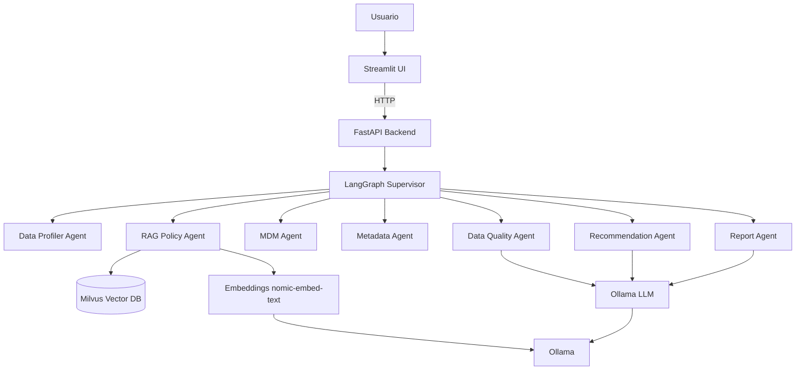
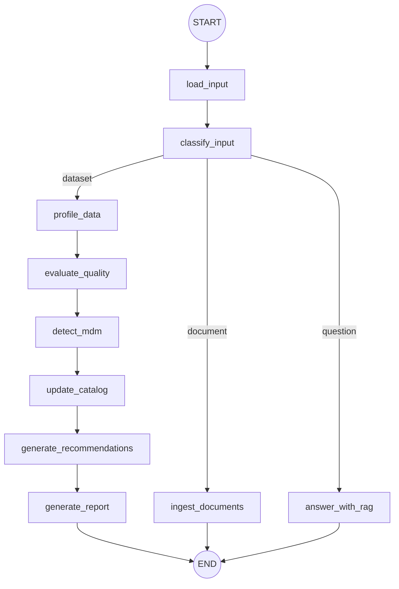

# Arquitectura — DataGov Agent

## 1. Visión general
DataGov Agent es un sistema agéntico local. La UI (Streamlit) consume una API (FastAPI) que orquesta
agentes especializados con LangGraph. El análisis de datos es determinista (Pandas); el LLM (Ollama)
añade narrativa, RAG y recomendaciones. La base vectorial es Milvus (Docker).

## 2. Diagrama de componentes

## 3. Flujo del grafo (LangGraph)

## 4. Capas de datos
- **Raw**: `data/raw/` y `data/synthetic/` (CSV) + `data/documents/` (políticas).
- **Curated**: perfiles, hallazgos, MDM y catálogo (en memoria / reportes).
- **Knowledge**: documentos indexados en Milvus para RAG.
- **Serving**: API + UI + reportes en `data/processed/reports/`.

## 5. Decisiones de diseño
- **Determinismo primero**: las métricas no dependen del LLM → testeable y reproducible.
- **Degradación elegante**: sin Ollama, los agentes usan fallbacks; sin Docker, el RAG usa un vector
  store en memoria (en tests) y la API devuelve un error accionable.
- **Milvus vía Docker**: en Windows, Milvus Lite no está disponible; se usa Milvus standalone.

## 6. Componentes clave (código)
| Componente | Ruta |
| ---------- | ---- |
| Configuración | `app/config.py` |
| Perfilado | `app/services/profiler.py` |
| Reglas de calidad + score | `app/services/quality_rules.py` |
| MDM | `app/services/mdm.py` |
| Embeddings | `app/services/embeddings.py` |
| Vector store (Milvus/Memory) | `app/services/vector_store.py` |
| LLM | `app/services/llm.py` |
| Agentes | `app/agents/*.py` |
| Grafo | `app/graph/*.py` |
| API | `app/api/*.py`, `app/main.py` |
| UI | `ui/streamlit_app.py` |

## 7. Roadmap futuro
- **Cloud**: AWS S3, Glue, Redshift, Athena, Lake Formation.
- **Gobierno empresarial**: Collibra/Purview/DataHub, roles y lineage.
- **Observabilidad**: logs de agentes, trazabilidad de prompts, métricas de RAG.
- **Seguridad**: control de acceso, enmascaramiento, clasificación automática de PII.
